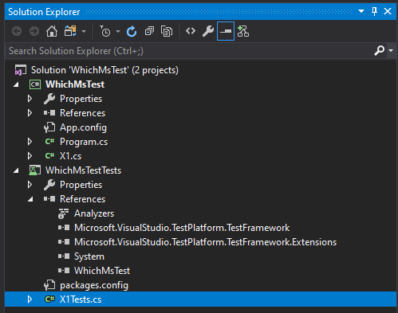

= Which Version of MS Test?

If you are using MsTest V2, you should see the following references in Solution Explorer:

You should also see a `using` statement as follows:

[source,c#]
----
using Microsoft.VisualStudio.TestTools.UnitTesting;
----

== Which **revision** of MSTestv2

MSTestv2 is open source: its home is on https://github.com/microsoft/testfx.git[github here].

Although the latest version as of 12 August 2020 is v2.1.2 (run `git tag` for details), **Visual Studio 2017** uses v1.3.2 by default (e.g. when 
selecting _Create Unit Tests_ from the context menu of a class.
**Visual Studio 2019** uses v2.1.1 by default.

== Differences from MSTest version 1

MSTestv2 includes more assertions - for example `Assert.ThrowsException<T>()`.

== MSTest.exe vs VSTest.Console.exe

Despite the fact that we are normally now using a _framework_ called MSTestv2, the preferred executable for _running_ tests is `vstest.console.exe`.

